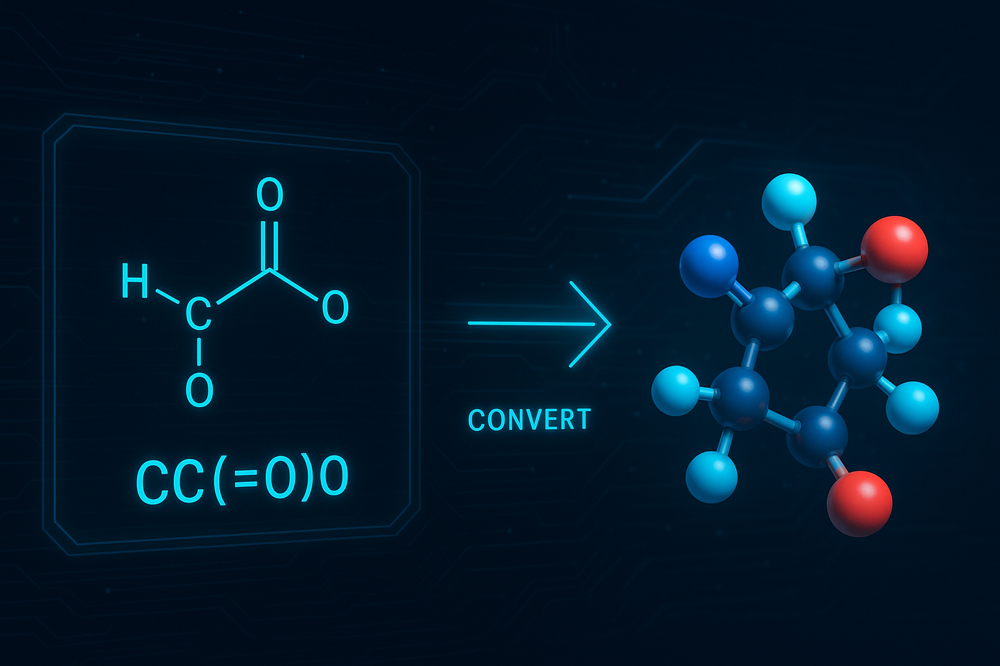

# smile2dock: SMILES-to-3D Molecular Format Converter
 
 
A Python tool for converting SMILES strings—single molecules or large libraries—into multiple 3D molecular formats (PDB, PDBQT, MOL2, SDF) for molecular docking and computational chemistry. The tool also calculates key physicochemical and pharmacokinetic properties using RDKit and Open Babel.
Features
- Input: Single SMILES string or a file (one SMILES per line)
- Generate protonation states for ph range [(**dimorphite_dl**)](https://durrantlab.github.io/dimorphite_dl/)
- 3D Structure Generation: Generates 3D coordinates and optimizes geometry
- Format Conversion: Exports to PDB, PDBQT, MOL2, and SDF formats
- Property Calculation: Calculates molecular weight, LogP, H-bond donors/acceptors, TPSA, rotatable bonds, and more
- Batch Processing: Handles large compound libraries efficiently
- Extensible: Easily add more descriptors or output formats

## Install the package

```
git clone git@github.com:elvismartis/smile2dock.git
```

## Requirements
- Python 3.7+
- RDKit
- Open Babel (with Python bindings: openbabel and pybel)
- dimorphite_dl

## Install dependencies
 ```
python3 -m venv </PATH/>cheminfo
source </PATH/>cheminfo/bin/activate
python3 -m pip install openbabel-wheel pybel rdkit dimorphite_dl
```

## General usage:
```

python3 smile2dock.py [-h] [-i INPUT] [-o OUTPUT] [-n NUM_CONFS] [--protonate] [--ph_min PH_MIN] [--ph_max PH_MAX] [--precision PRECISION] [--max_variants MAX_VARIANTS] [--reference REFERENCE] [--fp_type {morgan,rdkit}] [--radius RADIUS] [--bits BITS]

SMILES to 3D converter with protonation, property calculation, and similarity analysis

options:
  -h, --help                          #show this help message and exit
  -i, --input INPUT                   #SMILES string or input file
  -o, --output OUTPUT                 #Output directory or base name
  -n, --num_confs NUM_CONFS           #Number of conformers to generate (default: 10)
  --protonate                         #Enable protonation using Dimorphite-DL
  --ph_min PH_MIN                     #Minimum pH for protonation (default: 6.4)
  --ph_max PH_MAX                     #Maximum pH for protonation (default: 8.4)
  --precision PRECISION               #pKa precision factor (default: 1.0)
  --max_variants MAX_VARIANTS         #Maximum protonation variants (default: 128)
  --reference REFERENCE               #Reference SMILES for Tanimoto similarity
  --fp_type {morgan,rdkit}            #Fingerprint type
  --radius RADIUS                     #Morgan fingerprint radius (default: 2)
  --bits BITS                         #Fingerprint bit size (default: 2048)
```

### single molecule conversion

```
python3 smile2dock.py -i "CCO" -o ethanol
```
### single molecule conversion with protonation

```
python3 smile2dock.py -i "CCO" --protonate --ph_min 7.4 --ph_max 7.4 -o ethanol
```

### Single molecule conversion with Tanimoto similarity
```
python3 smile2dock.py -i "CCO" -o ethanol --reference "CCN"
```

### Batch Processing for molecular conversion
Given a file `molecules.smi` with one SMILES per line:
```
python3 smile2dock.py -i molecules.smi -o output_directory
```

### Batch Processing for molecular conversion with protonation

```
python3 smile2dock.py -i molecules.smi --protonate --ph_min 7.4 --ph_max 7.4 -o output_directory
```

### Batch Processing for molecular conversion with Tanimoto similarity
```
python3 smile2dock.py -i molecules.smi -o output_dir --reference "CCN"
```

### Output
For each molecule, the following files are generated:
```
pdb: Protein Data Bank format
pdbqt: AutoDock Vina format
mol2: SYBYL MOL2 format
sdf: Structure Data File
```

## Citation

### If you use Dimorphite-DL in your research, please cite:

Ropp PJ, Kaminsky JC, Yablonski S, Durrant JD (2019) Dimorphite-DL: An open-source program for enumerating the ionization states of drug-like small molecules. J Cheminform 11:14. doi: 10.1186/s13321-019-0336-9.

# Known Issues

## Incorrect aliphatic ring conformations
- It has been observed that on certain occasions, aliphatic ring conformations are incorrect. (*work in process to fix this*)

